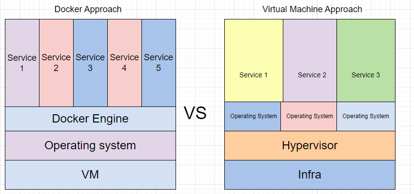
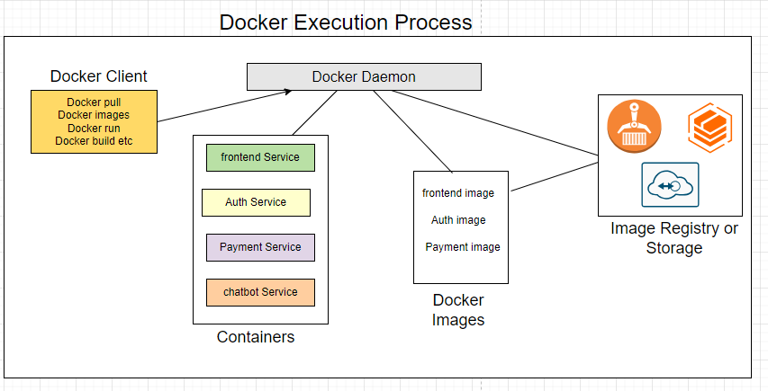

# Why Docker

Docker is a popular containerization platform that provides a lightweight and portable way to deploy applications. Here are some key reasons why Docker is a popular choice:

## Docker vs Virtual Machine

 

### 1.Portability

Docker images are lightweight and can be easily moved between environments, whereas VMs require a full OS installation.

### 2.Resource Efficiency

Docker containers share the host OS, reducing resource usage and overhead.

### 3.Faster Deployment

Docker images can be quickly spun up or down, whereas VMs require a full boot process.

### 4.Isolation

Docker provides process-level isolation, whereas VMs provide OS-level isolation.

### 5.Scalability

Docker containers can be easily scaled up or down, whereas VMs require more resources to scale.

## Sample Docker Use Cases

### 1.Application Deployment: 
Simplify deployment by containerizing applications with all dependencies, ensuring consistent environments across development, staging, and production.

### 2.Microservices Architecture: 
Run multiple microservices independently in isolated containers, allowing scalability and easier management.

### 3.Development Environment: 
Standardize development environments for teams to avoid "it works on my machine" issues.

### 4.CI/CD Pipelines: 
Streamline CI/CD processes by building, testing, and deploying applications in lightweight, reproducible Docker containers.

# Main Components of docker or contanirization process

 

## Common Docker Commands

### Commands to install and verfiy docker

* Command to install docker in ubuntu vm

  `sudo apt update  && sudo apt install docker.io -y `

* Command to check Docker version:

  `docker --version`
* Command to check the status of Docker: 

  `systemctl status docker`
* Command to start the Docker: 

  `systemctl start docker`
* Command to stop the Docker:

  `systemctl stop docker`
* Command to restart the Docker:

  `systemctl restart docker`

## How to build docker image and start the container

* command to build the docker image

  `docker build -t application-service .`

    follow proper naming for image like in aplication place give you portal name and in service place  give service name like frotned,auth,payment

* If dockerfile have different name

  `docker build -t application-service -f dockerfile-name . `

* If you want to pass arguments at the time of docker image build step

  `docker build -t application-service --build-arg SPRING_PROFILE=dev  . `

### Docker Image Commands

* Command to list all images present in the VM: 

  `docker images`
* Command to change the tag of an image:

  `docker tag frontend frontend-old`

### Docker Container Commands

* Command to list all the running containers: 

  `docker ps`
* Command to list all the containers (running and exited):

  `docker ps -a`
* Command to list all the volumes:

  `docker volumes ls`

* Command to run the container

  `docker run -d -p 8080:8080 --name container-name dockerimage`

  `docker run --restart unless-stopped  -e SPRING_PROFILE=dev -d -p 8080:8080 --name container-name dockerimage`

* Command to check logs of the containers

  `docker logs containername or containerID`

* command to check container logs of last 5 min 

  `docker --since 10m containername or containerID`

* command to check last 5 or 10 logs of container

  `docker logs --tail 10 containername or containerID`

* command to stop and remove container

  `docker stop containername(or id) && docker rm containernam(or id)`

* command to remove docker image
  `docker rmi image_id`

## Docker volumes
Docker volumes are a persistent storage solution that allows containers to store and share data. Unlike the container's filesystem, which is ephemeral (lost after the container stops), volumes persist data even if the container is removed. They are managed by Docker and are independent of the host file system

### ways to create docker volume

* command to create volume 

   `docker volume create volumename`

* command to attach volume to container
  
   `docker run -d -v volume_name:/app/files -p 5000:5000 --name container_name docker_image_name .`

* Instead of creating new volume you can attach one folder has volume using  command

   `docker run -d -v /home/path/files:/app/files -p 5000:5000 --name container_name docker_image_name .`

* command to inspect the docker image or volume or container

   `docker image inspect docker_image_name`

   `docker volume inspect docker_volume_name`

   `docker container inspect docker_container_name(orid)`

* command to remove all untagged images

   `docker image prune -f `

   if you add -a to above command it will remove tagged images also which are not used by any container

#### sample dockerfile for react,java,python and angular are there in above files
#### dockerfile will change accroding to need(example in python i need libraoffice,so i have added that step)
#### for react project I do not need build step for my use case so I have started the server dircetly